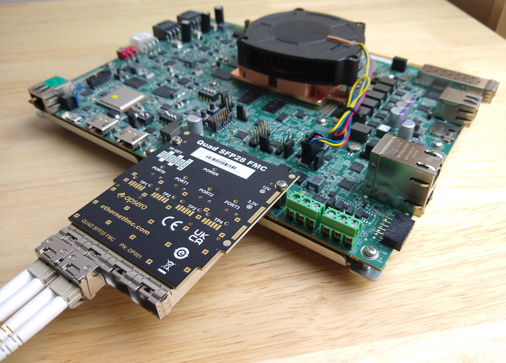

# 10G/25G Ethernet Reference Designs for the Opsero Quad SFP28 FMC

## Description

This project demonstrates the use of the Opsero [Quad SFP28 FMC] with 10G/25G Ethernet SFP+/SFP28 modules
and it supports several FPGA/MPSoC development boards.



Important links:

* The user guide for these reference designs is hosted here: [10G/25G Ethernet for Quad SFP28 FMC docs](https://sfp28-xxv.ethernetfmc.com "10G/25G Ethernet for Quad SFP28 FMC docs")
* To report a bug: [Report an issue](https://github.com/fpgadeveloper/sfp28-fmc-xxv/issues "Report an issue").
* For technical support: [Contact Opsero](https://opsero.com/contact-us "Contact Opsero").
* To purchase the mezzanine card: [Quad SFP28 FMC order page](https://opsero.com/product/quad-sfp28-fmc "Quad SFP28 FMC order page").

## Requirements

This project is designed for version 2024.1 of the Xilinx tools (Vivado/Vitis/PetaLinux). 
If you are using an older version of the Xilinx tools, then refer to the 
[release tags](https://github.com/fpgadeveloper/sfp28-fmc-xxv/tags "releases")
to find the version of this repository that matches your version of the tools.

In order to test this design on hardware, you will need the following:

* Vivado 2024.1
* PetaLinux Tools 2024.1
* [Quad SFP28 FMC]
* One of the target platforms listed below
* [Xilinx 10G/25G Ethernet MAC/PCS (25GEMAC) License](https://www.xilinx.com/products/intellectual-property/ef-di-25gemac.html)

## Target designs

This repo contains several designs that target various supported development boards and their
FMC connectors. The table below lists the target design name, the SFP28 ports supported by the design and 
the FMC connector on which to connect the Quad SFP28 FMC. Some of the target designs
require a license to generate a bitstream with the AMD Xilinx tools.

| Target board        | Target design     | Link speeds<br> supported | SFP28 ports | FMC Slot    | License<br> required | Verified |
|---------------------|-------------------|---------|-------------|-------------|-----|----|
| [KCU105]            | `kcu105_hpc`      | 10G     | 4x          | HPC         | YES | :x: |
| [UltraZed-EV carrier] | `uzev`          | 10G     | 4x          | HPC         | NO  | :white_check_mark: |
| [VCK190]            | `vck190_fmcp1`    | 10G/25G | 4x          | FMCP1       | YES | :white_check_mark: |
| [VCK190]            | `vck190_fmcp2`    | 10G/25G | 4x          | FMCP2       | YES | :white_check_mark: |
| [VEK280]            | `vek280`          | 10G/25G | 4x          | FMCP        | YES | :white_check_mark: |
| [VEK280] ES Rev-B   | `vek280_es_revb`  | 10G/25G | 4x          | FMCP        | YES | :white_check_mark: |
| [VMK180]            | `vmk180_fmcp1`    | 10G/25G | 4x          | FMCP1       | YES | :white_check_mark: |
| [VMK180]            | `vmk180_fmcp2`    | 10G/25G | 4x          | FMCP2       | YES | :white_check_mark: |
| [VPK120]            | `vpk120`          | 10G/25G | 4x          | FMCP        | YES | :white_check_mark: |
| [VCU118]            | `vcu118_fmcp`     | 10G/25G | 4x          | FMCP        | YES | :x: |
| [ZCU102]            | `zcu102_hpc0`     | 10G     | 4x          | HPC0        | YES | :white_check_mark: |
| [ZCU102]            | `zcu102_hpc1`     | 10G     | 4x          | HPC1        | YES | :white_check_mark: |
| [ZCU104]            | `zcu104`          | 10G     | 1x          | LPC         | NO  | :white_check_mark: |
| [ZCU106]            | `zcu106_hpc0`     | 10G     | 4x          | HPC0        | NO  | :white_check_mark: |
| [ZCU111]            | `zcu111`          | 10G/25G | 4x          | FMCP        | YES | :white_check_mark: |
| [ZCU208]            | `zcu208`          | 10G/25G | 4x          | FMCP        | YES | :white_check_mark: |
| [ZCU216]            | `zcu216`          | 10G/25G | 4x          | FMCP        | YES | :white_check_mark: |

## Build instructions

Clone the repo:
```
git clone https://github.com/fpgadeveloper/sfp28-fmc-xxv.git
```

Source Vivado and PetaLinux tools:

```
source <path-to-petalinux>/2024.1/settings.sh
source <path-to-vivado>/2024.1/settings64.sh
```

Build all (Vivado project and PetaLinux):

```
cd sfp28-fmc-xxv/PetaLinux
make petalinux TARGET=zcu106_hpc0
```

## Contribute

We strongly encourage community contribution to these projects. Please make a pull request if you
would like to share your work:
* if you've spotted and fixed any issues
* if you've added designs for other target platforms

Thank you to everyone who supports us!

## About us

This project was developed by [Opsero Inc.](https://opsero.com "Opsero Inc."),
a tight-knit team of FPGA experts delivering FPGA products and design services to start-ups and tech companies. 
Follow our blog, [FPGA Developer](https://www.fpgadeveloper.com "FPGA Developer"), for news, tutorials and
updates on the awesome projects we work on.

[Quad SFP28 FMC]: https://ethernetfmc.com/docs/quad-sfp28-fmc/overview/
[VCK190]: https://www.xilinx.com/vck190
[VEK280]: https://www.xilinx.com/vek280
[VMK180]: https://www.xilinx.com/vmk180
[VPK120]: https://www.xilinx.com/vpk120
[VCU108]: https://www.xilinx.com/vcu108
[VCU118]: https://www.xilinx.com/vcu118
[KCU105]: https://www.xilinx.com/kcu105
[ZCU111]: https://www.xilinx.com/zcu111
[ZCU208]: https://www.xilinx.com/zcu208
[ZCU216]: https://www.xilinx.com/zcu216
[UltraZed-EV carrier]: https://www.xilinx.com/products/boards-and-kits/1-y3n9v1.html
[ZCU102]: https://www.xilinx.com/zcu102
[ZCU104]: https://www.xilinx.com/zcu104
[ZCU106]: https://www.xilinx.com/zcu106

