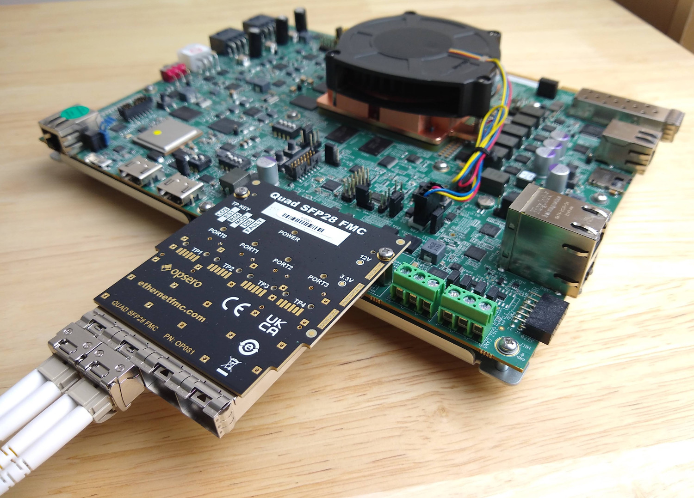

# 10G/25G Ethernet Reference Designs for the Opsero Quad SFP28 FMC

## Description

This project demonstrates the use of the Opsero [Quad SFP28 FMC] (OP081) with 10G/25G Ethernet SFP+/SFP28 modules
and it supports several FPGA/MPSoC development boards.



Important links:

* The user guide for these reference designs is hosted here: [10G/25G Ethernet for Quad SFP28 FMC docs](https://sfp28-xxv.ethernetfmc.com "10G/25G Ethernet for Quad SFP28 FMC docs")
* To report a bug: [Report an issue](https://github.com/fpgadeveloper/sfp28-fmc-xxv/issues "Report an issue").
* For technical support: [Contact Opsero](https://opsero.com/contact-us "Contact Opsero").
* To purchase the mezzanine card: [Quad SFP28 FMC order page](https://opsero.com/product/quad-sfp28-fmc "Quad SFP28 FMC order page").

## Requirements

This project is designed for version 2025.2 of the Xilinx tools (Vivado/Vitis/PetaLinux). 
If you are using an older version of the Xilinx tools, then refer to the 
[release tags](https://github.com/fpgadeveloper/sfp28-fmc-xxv/tags "releases")
to find the version of this repository that matches your version of the tools.

In order to test this design on hardware, you will need the following:

* Vivado 2025.2
* PetaLinux Tools 2025.2
* [Quad SFP28 FMC]
* One of the target platforms listed below
* [Xilinx 10G/25G Ethernet MAC/PCS (25GEMAC) License](https://www.xilinx.com/products/intellectual-property/ef-di-25gemac.html)

## Target designs

This repo contains several designs that target various supported development boards and their
FMC connectors. The table below lists the target design name, the SFP28 ports supported by the design and 
the FMC connector on which to connect the Quad SFP28 FMC. Some of the target designs
require a license to generate a bitstream with the AMD Xilinx tools.

<!-- updater start -->
### 10G designs

| Target board          | Target design      | Link speeds <br> supported | SFP28 ports | FMC Slot    | Yocto | Vivado<br> Edition | IP<br>License |
|-----------------------|--------------------|------------|-------------|-------------|-------|-------|-------|
| [UltraZed-EV Carrier] | `uzev`             | 10G        | 4x          | HPC         | :white_check_mark: | Standard :free: | Required |
| [VCK190]              | `vck190_fmcp1`     | 10G        | 4x          | FMCP1       | :white_check_mark: | Enterprise | Required |
| [VCK190]              | `vck190_fmcp2`     | 10G        | 4x          | FMCP2       | :white_check_mark: | Enterprise | Required |
| [VEK280]              | `vek280`           | 10G        | 4x          | FMCP        | :white_check_mark: | Enterprise | Required |
| [VHK158]              | `vhk158`           | 10G        | 4x          | FMCP        | :white_check_mark: | Enterprise | Required |
| [VMK180]              | `vmk180_fmcp1`     | 10G        | 4x          | FMCP1       | :white_check_mark: | Enterprise | Required |
| [VMK180]              | `vmk180_fmcp2`     | 10G        | 4x          | FMCP2       | :white_check_mark: | Enterprise | Required |
| [VPK120]              | `vpk120`           | 10G        | 4x          | FMCP        | :white_check_mark: | Enterprise | Required |
| [VPK180]              | `vpk180`           | 10G        | 4x          | FMCP        | :white_check_mark: | Enterprise | Required |
| [ZCU102]              | `zcu102_hpc0`      | 10G        | 4x          | HPC0        | :white_check_mark: | Enterprise | Required |
| [ZCU102]              | `zcu102_hpc1`      | 10G        | 4x          | HPC1        | :white_check_mark: | Enterprise | Required |
| [ZCU104]              | `zcu104`           | 10G        | 1x          | LPC         | :white_check_mark: | Standard :free: | Required |
| [ZCU106]              | `zcu106_hpc0`      | 10G        | 4x          | HPC0        | :white_check_mark: | Standard :free: | Required |
| [ZCU106]              | `zcu106_hpc1`      | 10G        | 1x          | HPC1        | :white_check_mark: | Standard :free: | Required |
| [ZCU111]              | `zcu111`           | 10G        | 4x          | FMCP        | :white_check_mark: | Enterprise | Required |
| [ZCU208]              | `zcu208`           | 10G        | 4x          | FMCP        | :white_check_mark: | Enterprise | Required |
| [ZCU216]              | `zcu216`           | 10G        | 4x          | FMCP        | :white_check_mark: | Enterprise | Required |

### 25G designs

| Target board          | Target design      | Link speeds <br> supported | SFP28 ports | FMC Slot    | Yocto | Vivado<br> Edition | IP<br>License |
|-----------------------|--------------------|------------|-------------|-------------|-------|-------|-------|
| [VCK190]              | `vck190_fmcp1_25g` | 25G        | 4x          | FMCP1       | :white_check_mark: | Enterprise | Required |
| [VCK190]              | `vck190_fmcp2_25g` | 25G        | 4x          | FMCP2       | :white_check_mark: | Enterprise | Required |
| [VEK280]              | `vek280_25g`       | 25G        | 4x          | FMCP        | :white_check_mark: | Enterprise | Required |
| [VHK158]              | `vhk158_25g`       | 25G        | 4x          | FMCP        | :white_check_mark: | Enterprise | Required |
| [VMK180]              | `vmk180_fmcp1_25g` | 25G        | 4x          | FMCP1       | :white_check_mark: | Enterprise | Required |
| [VMK180]              | `vmk180_fmcp2_25g` | 25G        | 4x          | FMCP2       | :white_check_mark: | Enterprise | Required |
| [VPK120]              | `vpk120_25g`       | 25G        | 4x          | FMCP        | :white_check_mark: | Enterprise | Required |
| [VPK180]              | `vpk180_25g`       | 25G        | 4x          | FMCP        | :white_check_mark: | Enterprise | Required |
| [ZCU111]              | `zcu111_25g`       | 25G        | 4x          | FMCP        | :white_check_mark: | Enterprise | Required |
| [ZCU208]              | `zcu208_25g`       | 25G        | 4x          | FMCP        | :white_check_mark: | Enterprise | Required |
| [ZCU216]              | `zcu216_25g`       | 25G        | 4x          | FMCP        | :white_check_mark: | Enterprise | Required |

[UltraZed-EV Carrier]: https://www.xilinx.com/products/boards-and-kits/1-1s78dxb.html
[VCK190]: https://www.xilinx.com/vck190
[VEK280]: https://www.xilinx.com/vek280
[VHK158]: https://www.xilinx.com/vhk158
[VMK180]: https://www.xilinx.com/vmk180
[VPK120]: https://www.xilinx.com/vpk120
[VPK180]: https://www.xilinx.com/vpk180
[ZCU102]: https://www.xilinx.com/zcu102
[ZCU104]: https://www.xilinx.com/zcu104
[ZCU106]: https://www.xilinx.com/zcu106
[ZCU111]: https://www.xilinx.com/zcu111
[ZCU208]: https://www.xilinx.com/zcu208
[ZCU216]: https://www.xilinx.com/zcu216
<!-- updater end -->

Notes:
1. The Vivado Edition column indicates which designs are supported by the Vivado *Standard* Edition, the
   FREE edition which can be used without a license. Vivado *Enterprise* Edition requires
   a license however a 30-day evaluation license is available from the AMD Xilinx Licensing site.
2. All of the 25G designs have the `_25g` postfix in the target label.

## Software

These reference designs can be driven within a PetaLinux environment. 
The repository includes all necessary scripts and code to build the PetaLinux environments. The table 
below outlines the corresponding applications available in each environment:

| Environment      | Available Applications  |
|------------------|-------------------------|
| PetaLinux        | Built-in Linux commands<br>Additional tools: ethtool, phytool, iperf3 |

## Build instructions

Clone the repo and change into its directory:
```
git clone https://github.com/fpgadeveloper/sfp28-fmc-xxv.git
cd sfp28-fmc-xxv
```

### Cross-platform build runner

All builds are driven by `build.py` at the repo root, on both Windows
(git bash) and Linux. The `build.sh` / `build.bat` shim finds a suitable
Python 3 automatically (including the one bundled with the AMD tools).
Pick a target design label from the tables above (or run `./build.sh
list`), then run the build command for the stage(s) you want — each
command builds whatever it depends on automatically and skips anything
already built. On Windows without git bash, run the same commands from
Command Prompt or PowerShell using `build.bat` (e.g. `build.bat xsa
--target <target>`).

You don't need to source the AMD tools first — the build runner finds
Vivado, Vitis and PetaLinux automatically in their standard install
locations and sets up the environment each stage needs. If your tools
are installed somewhere non-standard and the runner can't find them,
source the tool settings yourself before running the build.

#### Build the Vivado project (bitstream + XSA)

```
./build.sh xsa --target <target>
```

#### Build PetaLinux (Linux only)

```
./build.sh petalinux --target <target>
```

#### Build everything

Builds all of the above that the target supports, then gathers the boot
images into `bootimages/*.zip`:

```
./build.sh all --target <target>
./build.sh all --target all          # every target in the repo
```

Also available: `status`, `clean`, `project` — see
`./build.sh --help`. On Windows, the PetaLinux and Yocto stages require a
Linux machine; the runner says so and prints the hand-off command. The
legacy `make` interface still works on Linux (each Makefile now wraps
`build.sh`) but is deprecated and will be removed at the next version
update.

## Contribute

We strongly encourage community contribution to these projects. Please make a pull request if you
would like to share your work:
* if you've spotted and fixed any issues
* if you've added designs for other target platforms

Thank you to everyone who supports us!

## About us

This project was developed by [Opsero Inc.](https://opsero.com "Opsero Inc."),
a tight-knit team of FPGA experts delivering FPGA products and design services to start-ups and tech companies. 
Follow our blog, [FPGA Developer](https://www.fpgadeveloper.com "FPGA Developer"), for news, tutorials and
updates on the awesome projects we work on.

[Quad SFP28 FMC]: https://docs.opsero.com/op081/datasheet/overview/

