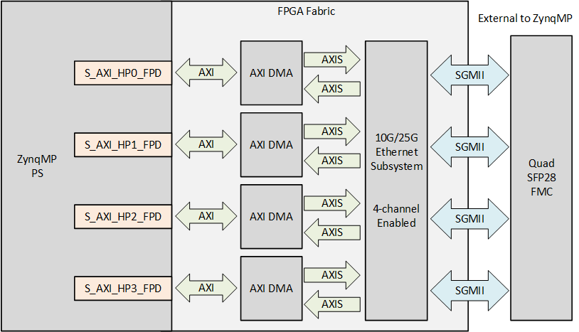
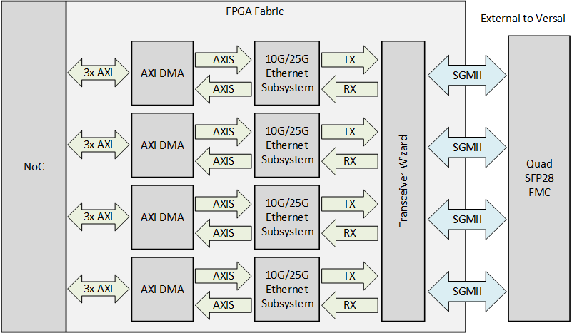

# Description

In this reference design, each port of the [Quad SFP28 FMC] is connected to an [10G/25G Ethernet Subsystem IP]
which is connected to the system memory via an AXI DMA IP. 

## Block diagrams

The repository contains designs for both Zynq
UltraScale+ platforms and Versal platforms. The block diagrams for the designs are shown below:

### Zynq UltraScale+ designs

### Versal designs

## Supported Hardware Platforms

The hardware designs provided in this reference are based on Vivado and support a range of FPGA, MPSoC and ACAP evaluation
boards. The repository contains all necessary scripts and code to build these designs for the supported platforms listed below:



    
        
            
        
        
            
        
        
            
        
    



    
    
        
            
        
    

    
### {{ group.name }} boards

| Carrier board    | Supported FMC connector(s) | 10G support | 25G support |
|------------------|----------------------------|-------------|-------------|
| [{{ name }}]({{ board.link }}) | {{ connector }}  |  ✅  Not supported  |  ✅  Not supported  |




Note that some of the hardware platforms cannot support 25G link speeds due to the limitations of the 
gigabit transceivers of the devices on those platforms.

## Supported Software

These reference designs can be driven within a PetaLinux environment. 
The repository includes all necessary scripts and code to build the PetaLinux environments. The table 
below outlines the corresponding applications available in each environment:

| Environment      | Available Applications  |
|------------------|-------------------------|
| PetaLinux        | Built-in Linux commands Additional tools: ethtool, phytool, iperf3 |

[Quad SFP28 FMC]: https://ethernetfmc.com/docs/quad-sfp28-fmc/overview/
[10G/25G Ethernet Subsystem IP]: https://www.xilinx.com/products/intellectual-property/ef-di-25gemac.html