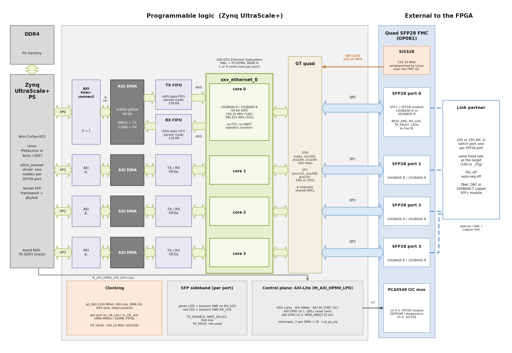
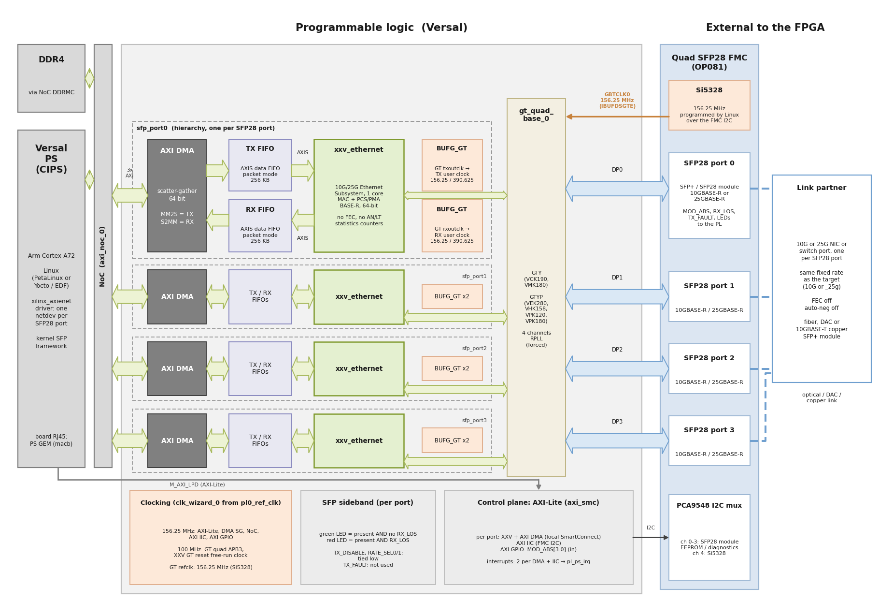

# Description

In this reference design, each port of the [Quad SFP28 FMC] is connected to a channel of the AMD
[10G/25G Ethernet Subsystem IP] (XXV Ethernet), which is connected to the system memory via an
AXI DMA IP. Linux (PetaLinux or Yocto) runs on the Arm processors of the Zynq UltraScale+ or Versal
device and presents each SFP28 port as a standard network interface, driven by the
`xilinx_axienet` driver.

## Block diagrams

The repository contains designs for both Zynq UltraScale+ platforms and Versal platforms. The block
diagrams below are drawn from the block-design scripts (`Vivado/src/bd/bd_zynqmp.tcl` and
`Vivado/src/bd/bd_versal.tcl`). Port 0 is shown in detail; ports 1 to 3 are identical copies.

### Zynq UltraScale+ designs

### Versal designs

The diagrams are generated by the script `docs/source/images/gen_block_diagram.py`
(`python3 docs/source/images/gen_block_diagram.py`). If you modify the block design, update and
re-run the script to keep the diagrams in sync.

## Hardware design

### Ethernet datapath (per SFP28 port)

| Element | Zynq UltraScale+ | Versal |
|---------|------------------|--------|
| MAC + PCS/PMA | One `xxv_ethernet_0` IP with one core per SFP28 port (`NUM_OF_CORES` = 1 or 4) | One `xxv_ethernet` IP per SFP28 port, inside the `sfp_port<N>` hierarchy |
| Configuration | BASE-R, MAC+PCS/PMA 64-bit, AXI4-Stream user interface, statistics counters, no FEC, no auto-negotiation / link training | same |
| Line rate | 10G (`10GBASE-R`) or 25G (`25GBASE-R`), fixed at build time by the target | same |
| Transceivers | GTH (`uzev`, `zcu102`, `zcu104`, `zcu106`: 10G only) or GTY (`zcu111`, `zcu208`, `zcu216`) | `gt_quad_base` with GTY (VCK190, VMK180) or GTYP (VEK280, VHK158, VPK120, VPK180); TX/RX PLL forced to RPLL |
| DMA | AXI DMA, scatter-gather, 64-bit, behind its own AXI Interconnect to `S_AXI_HP<N>_FPD` | AXI DMA, scatter-gather, 64-bit, three AXI-MM masters into the NoC |
| FIFOs | TX and RX AXI4-Stream data FIFOs, packet mode, 16384 × 8 bytes (128 KB) each | TX and RX AXI4-Stream data FIFOs, packet mode, 32768 × 8 bytes (256 KB) each |
| User clocks | `tx_clk_out` / `rx_clk_out` of the XXV core: 156.25 MHz (10G) or 390.625 MHz (25G) | `BUFG_GT` on the GT `txoutclk` / `rxoutclk`: 156.25 MHz (10G) or 390.625 MHz (25G) |

The SFP28 lanes use the FMC data pairs DP0 to DP3 (SFP28 port N on DPN) of a single GT quad.
The GT reference clock (156.25 MHz) comes from the Si5328 clock generator on the Quad SFP28 FMC,
through the FMC `GBTCLK0_M2C` clock input. The Si5328 is programmed by Linux over the FMC I2C bus
when the kernel boots.

### Control and status

* **AXI-Lite**: the XXV cores, AXI DMAs, AXI IIC and AXI GPIO are controlled by the processor
  through `M_AXI_HPM0_LPD` (Zynq UltraScale+) or `M_AXI_LPD` and an AXI SmartConnect (Versal).
* **AXI IIC**: the FMC I2C bus. A PCA9548 I2C mux on the Quad SFP28 FMC gives access to the
  EEPROM / diagnostics of each SFP28 module (channels 0 to 3) and to the Si5328 (channel 4).
* **AXI GPIO**: the four active-low `MOD_ABS` (module absent) signals are read by the Linux SFP
  framework, so that only cages with a module fitted are brought up. On Zynq UltraScale+ the same
  GPIO (channel 1) also drives the shared QPLL reset input of the XXV IP — see
  [QPLL reset](#qpll-reset-zynq-ultrascale) below.
* **Interrupts**: the MM2S and S2MM interrupts of each AXI DMA and the AXI IIC interrupt are
  connected to the PL-to-PS interrupt inputs.

### SFP28 sideband signals and LEDs

Each SFP28 cage has a green and a red LED driven by logic in the PL:

* Both LEDs are off when no module is present.
* The green LED is on when a module is present and there is no loss of signal (`RX_LOS` low).
* The red LED is on when a module is present and there is loss of signal (`RX_LOS` high).

`TX_DISABLE`, `RATE_SEL0` and `RATE_SEL1` are tied low (transmitter always enabled), and `TX_FAULT`
is not used. As a result the Linux SFP framework reports `No tx_disable pin: SFP modules will
always be emitting.` at boot; this message is expected.

### QPLL reset (Zynq UltraScale+)

On Zynq UltraScale+ the four XXV cores share the QPLL of the GTH/GTY quad. When Linux programs
the Si5328 at boot, the GT reference clock is briefly interrupted and the QPLL must be reset to
lock again. The designs connect the `qpllreset_in_0` input of the XXV IP to an AXI GPIO output,
and the Linux kernel of both the PetaLinux and the Yocto flows carries a patch
(`0001-xxv-qpllreset-gpio.patch`) that pulses this GPIO once, at the first device reset after
the driver has probed, before the DMA reset. The GPIO
is described in the device tree by the `qpllreset-gpios` property. Versal designs do not need it.

## Supported Hardware Platforms

The hardware designs provided in this reference are based on Vivado and support a range of FPGA, MPSoC and ACAP evaluation
boards. The repository contains all necessary scripts and code to build these designs for the supported platforms listed below:



    
        
            
        
        
            
        
        
            
        
    



    
    
        
            
        
    

    
### {{ group.name }} boards

| Carrier board    | Supported FMC connector(s) | 10G support | 25G support |
|------------------|----------------------------|-------------|-------------|
| [{{ name }}]({{ board.link }}) | {{ connector }}  |  ✅  Not supported  |  ✅  Not supported  |




Note that some of the hardware platforms cannot support 25G link speeds due to the limitations of the 
gigabit transceivers of the devices on those platforms (the GTH transceivers of the ZCU102, ZCU104,
ZCU106 and UltraZed-EV).

## Supported Software

These reference designs are driven from embedded Linux. The repository includes all necessary
scripts and code to build the Linux images with either of two flows; both produce an equivalent
image. There is no standalone (baremetal) application for this design.

| Environment      | Available Applications  |
|------------------|-------------------------|
| PetaLinux        | Built-in Linux commands Additional tools: ethtool, phytool, iperf3 |
| Yocto (AMD EDF)  | Built-in Linux commands Additional tools: ethtool, phytool, iperf3, pciutils, mtd-utils, can-utils, nfs-utils |

See [PetaLinux](petalinux) and [Yocto](yocto) for how to build, boot and test each image, and
[Testing the SFP28 ports](testing) for the link-partner setup and the expected results.

[Quad SFP28 FMC]: https://docs.opsero.com/op081/datasheet/overview/
[10G/25G Ethernet Subsystem IP]: https://www.xilinx.com/products/intellectual-property/ef-di-25gemac.html
